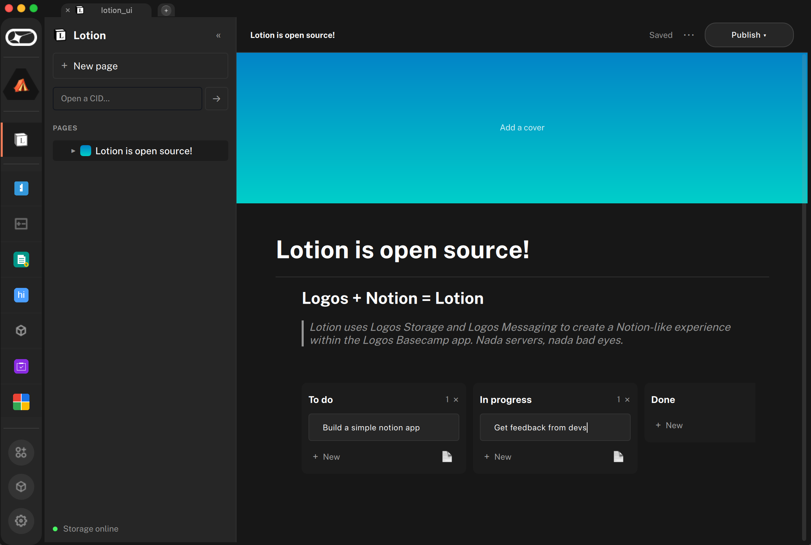

<p align="center">
  
</p>

<h1 align="center">Lotion</h1>

<p align="center"><em>logos + notion</em> — a Notion-style, local-first writer</p>

A two-module app that turns `storage_module` into a small Notion-style
writing app. You keep a **local workspace** of pages that open instantly
and autosave offline; **publishing to logos-storage is optional and
per-page**. Publish a page and you get back a shareable CID; paste someone
else's CID to read their article (and a password, if it's private).



## What's here

- **`lotion-core/`** — C++ plugin. Owns the **local workspace** (a
  SQLite `documents` table: create / save / list / delete / mark-published),
  the **envelope format** (JSON, AES-256-GCM when private) with its
  **PBKDF2-derived key**, and the **temp-file I/O** that hands envelope
  bytes to and from `storage_module`. Does **not** call `storage_module`
  itself — see the note below.
- **`lotion-ui/`** — QML frontend, a persistent sidebar + editor shell.
  Pages edit and autosave locally; the app opens straight to your
  workspace without waiting on the network. Talks to `storage_module`
  directly via the `logos.callModule("storage_module", ...)` JS bridge
  only when you publish or read a remote CID.

## Architecture: why the storage calls live in QML, not C++

`storage_module.init()` (and several other storage entry points) call
Qt's `QEventLoop::waitForSignal` with a 1 s timeout. When invoked from a
C++ plugin, `logos_host` dispatches the method on a worker thread that has
no visible `QCoreApplication` — the event loop can't pump, the wait times
out, and libstorage's discovery thread enters an infinite retry loop that
pegs CPU and hangs all subsequent IPC. Symptom: pressing **Start** in the
UI does nothing, and Basecamp hangs.

The QML/JS bridge runs on the main thread with `QCoreApplication`
available, so the same calls succeed when made from `Main.qml`. The
takeaway: drive `storage_module` from QML, and keep `lotion-core` for the
local workspace and crypto only.

Split for this module:

```
┌─────────────────────────────┐
│        lotion-ui        │
│ ─ workspace sidebar + editor│──── logos.callModule("lotion", …) ─────►  (local CRUD + crypto)
│ ─ autosave (local-first)    │
│ ─ publish / read a CID      │──── logos.callModule("storage_module", …) ──►  (only when needed)
└─────────────────────────────┘
```

`lotion-core` methods:

| Method | What it does |
| --- | --- |
| `createDocument()` | New empty page; returns its local id. |
| `saveDocument(id, title, body, cover, isPrivate)` | Autosave upsert (no network). |
| `listDocuments()` / `getDocument(id)` | JSON for the sidebar / open page. |
| `deleteDocument(id)` | Remove a page. |
| `markPublished(id, cid)` | Record that a page was pushed to storage. |
| `prepareEnvelopeFile(title, body, pw, metaJson)` | Build envelope JSON (+ meta: `publishedAt`, `cover`), write temp file, return path. |
| `consumeEnvelopeFile(path, pw)` | Read a downloaded file, parse + (maybe) decrypt, return JSON. |

`lotion-ui` flows:

1. **Edit (local):** `createDocument` → type → debounced `saveDocument`. No storage involved; works offline.
2. **Publish:** `prepareEnvelopeFile` → path → `storage_module.uploadUrl(path)` → CID via `storageUploadDone` event → `markPublished(id, cid)`.
3. **Read a CID:** `storage_module.downloadToUrl(cid, tempPath)` → `storageDownloadDone` event → `consumeEnvelopeFile(tempPath, password)` → render (or surface the password prompt) → optionally **Duplicate to workspace**.

## Envelope format

Every article on storage is a JSON blob of one of two shapes:

**Public:**

```json
{
  "v": 1,
  "private": false,
  "title": "Hello",
  "body": "# Hello\n\nA paragraph."
}
```

**Private:** the inner `{title, body}` JSON is AES-256-GCM encrypted; the
envelope carries everything the reader needs *except* the password.

```json
{
  "v": 1,
  "private": true,
  "kdf": "PBKDF2-HMAC-SHA256",
  "iter": 200000,
  "salt":       "<base64, 16 bytes>",
  "nonce":      "<base64, 12 bytes>",
  "tag":        "<base64, 16 bytes>",
  "ciphertext": "<base64, AES-256-GCM ciphertext of {title, body} JSON>"
}
```

The title is also encrypted for private envelopes — only the CID + the
password yield anything human-readable.

## Building

```bash
cd lotion-core
nix build '.#lgx-portable' --out-link result-portable

cd ../lotion-ui
nix build --override-input lotion path:../lotion-core '.#lgx-portable' --out-link result-portable
```

`storage_module` is NOT pre-installed on Basecamp — install it separately:

```bash
nix build github:logos-co/logos-storage-module --out-link /tmp/storage
cp /tmp/storage/lib/* "$HOME/Library/Application Support/Logos/LogosBasecamp/modules/"
# Linux: "$HOME/.local/share/Logos/LogosBasecamp/modules/"
```

Then import both publishing `.lgx` files via Basecamp's **Modules → Install
LGX Package**.

## What you'll see

- The app opens straight to your **workspace** — a sidebar of pages plus an
  editor. A footer dot shows storage connecting in the background; you can
  write immediately without waiting for it.
- **New page** → type a title + Markdown body, pick a cover gradient. It
  autosaves locally as you type ("Saving…/Saved" in the editor bar). It can
  stay a private local draft forever.
- **Publish ▾** → choose public or private (password), hit Publish. The page
  uploads to logos-storage and shows a **Live** dot + its CID with a copy
  button. Re-publishing after edits mints a new CID and updates the page.
- **Open a CID…** (sidebar) → reads a remote article: cover, title,
  `time · by anonymous · CID`, then the rendered Markdown. Private CIDs
  surface an inline password prompt (the downloaded envelope is cached so a
  retry doesn't re-hit storage). **Duplicate to workspace** clones it into
  an editable local page.

## What's intentionally *not* here

- **No discovery.** A CID is a fetch key, not a directory — share CIDs
  out-of-band. A `delivery_module` topic for "announce" messages would be
  the natural next step.
- **No deletion-from-storage.** Deleting a page removes the local row; if it
  was published, the envelope stays on logos-storage forever (anyone who
  saved the CID can still fetch it — that's what content-addressing means).
- **No revocation for private articles.** Once a password is out, the
  envelope is readable forever. Rotate by re-publishing under a new CID
  with a new password.
- **Passwords aren't stored.** A private page remembers it's private, but
  you re-enter the password each time you publish — we never persist it.
